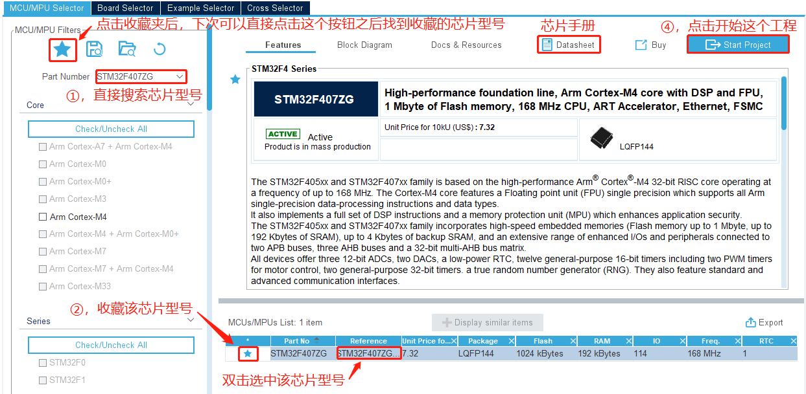
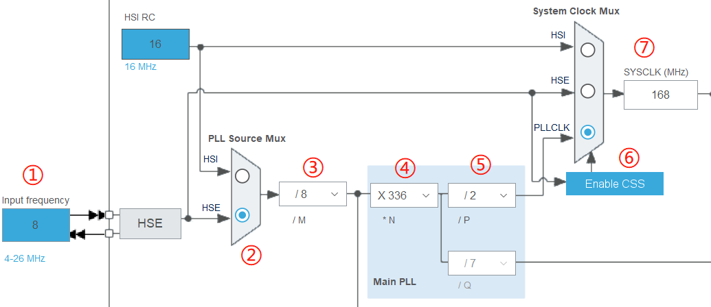
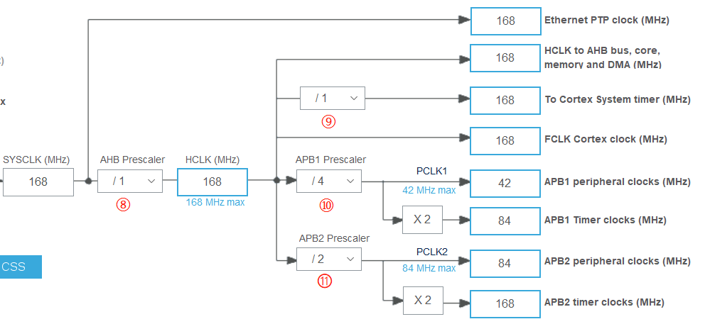
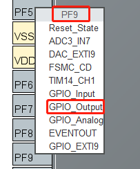
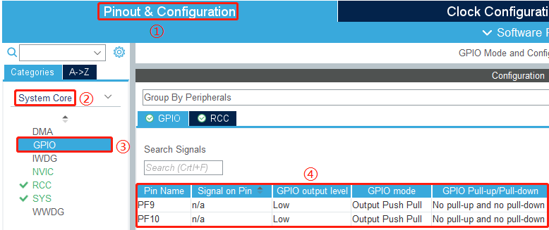
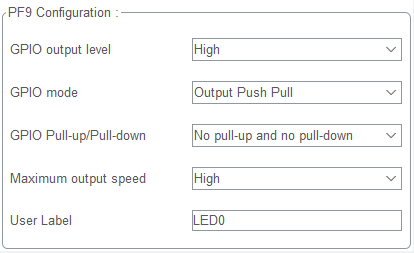
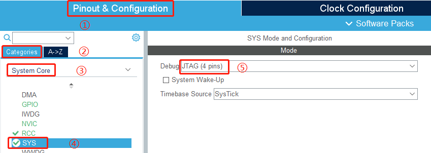
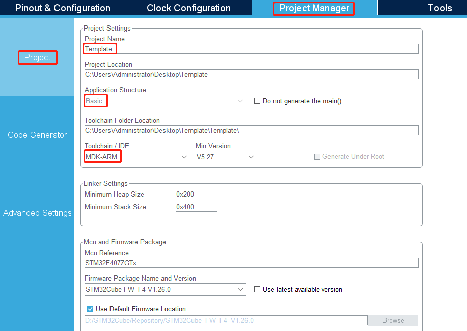

# environment

## STM32CubeMX

1. 工程初步建立
2. HSE 和 LSE 时钟源设置
3. 时钟系统(时钟树)配置
4. GPIO 功能引脚配置
5. Cortex-M4 内核基本配置(限定项)
6. 生成工程源码
7. 用户程序

保留 `*.ioc` 文件, 以便后续修改

## 工程初步建立

File > new project

## 时钟源设置

4 和 5 即时设置外部时钟

## 时钟树配置

我们将配置一个以 HSE 为时钟源,配置 PLL 相关参数,然后系统时钟选择 PLLCLK 为时钟源,最终配置系统时钟为 168MHz 的过程.同时,还配置了 AHB,APB1,APB 和 Systick 的相关分频系数

1. 配置系统时钟
2. 配置 SYSTICK,AHB,APB1 和 APB2 的分频系数

### 配置系统时钟

1. 时钟源参数设置:我们选择 HSE 为时钟源,所以设置为实际的 8 MHz.
2. 时钟源选择:我们配置选择器选择 HSE 即可.
3. PLL1 分频系数 M 配置.分频系数 M 我们设置为 8.
4. PLL1 倍频系数 N 配置.倍频系数 N 我们设置为 336.
5. PLL1 分频系数 P 配置.分频系数 P 我们配置为 2.
6. 系统时钟时钟源选择:PLL,HSI 还是 HSE.我们选择 PLL,选择器选择 PLLCLK 即可.
7. 经过上面配置以后此时 SYSCLK=168MHz.

### 配置分频系数

可以手动标注, 也可以在 HCLK 中输入设定的数字, 让软件自动配置

## GPIO 功能引脚配置

1. 搜索栏输入想要的 pin PF9
2. 设置 IO 功能为 GPIO_Output
3. 配置参数

## 配置 Debug 选项

## 生成工程

- 选 Basic
- IDE 选 Makefile
- Code Generator: Generate peripheral initialization as a pair of '.c/.h' files per peripheral

?> 点击 Generate Code 生成工程

## Reference

- [使用 VSCode+PlatformIO+HAL+CubeMX+正点原子库开发 STM32F407ZGT6_vscode 外星人插件\_Kenyon_Lv 的博客-CSDN 博客](https://blog.csdn.net/qq_36807337/article/details/123030937)
